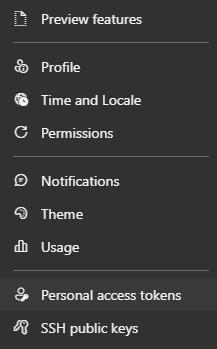
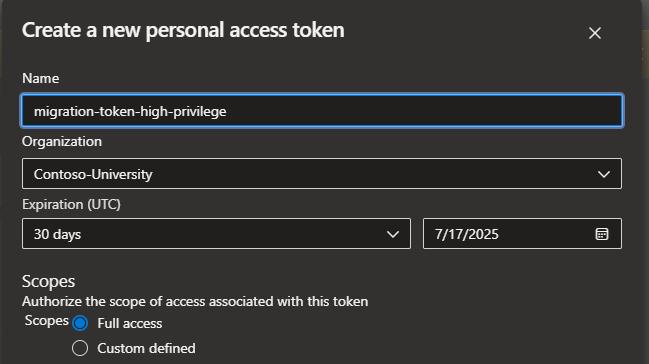

# Azure DevOps Repository Migration Tool

A Python-based CLI tool for merging separate production and non-production Azure DevOps Git repositories into a single consolidated repository while preserving commit history.

## Overview

This tool automates the process of combining two separate Git repositories in Azure DevOps into a single repository. The production repository history is preserved in the main branch, while the non-production repository history becomes a separate development branch.

## Features

- Creates a new consolidated repository in Azure DevOps
- Imports complete history from production repository
- Preserves non-production repository history in a separate branch
- Supports authentication via Personal Access Tokens (PAT) or existing Azure CLI sessions
- Detailed logging with verbose output option

## Requirements

- Python 3.11 or higher
- Azure DevOps CLI extension (`az devops`) installed and configured
- Git installed and configured
- Access permissions to create repositories and import code in your Azure DevOps project

## Installation

1. Clone this repository:
   ```bash
   git clone https://github.com/yourusername/ado-repo-migration.git
   cd ado-repo-migration
   ```

2. Install dependencies:
   ```bash
   pip install -r requirements.txt
   ```

3. Retrieve PAT Token
    1. Naviagate to your organization's Azure DevOps Landing Page (https://dev.azure.com/<your-org>/<your-project>)
    2. Select User Settings <br>
        <br>
    3. Select Personal access tokens <br>
        <br>
    4. Create New Token<br>
        <br>
    5. Create Token<br>
        <br>
    6. Be sure to securely store the token either in an Azure Key Vault or Secure Pipeline Variable
    

## Usage

The script is designed to run in an Ubuntu environment (such as with ubuntu-latest in Azure DevOps pipelines) but can be run in any environment with the required dependencies.

### Basic Command Format

```bash
python src/ado-git-migration-cli.py \
    --org-url https://dev.azure.com/your-organization \
    --project your-project \
    --prod-repo production-repo-name \
    --non-prod-repo non-production-repo-name \
    --target consolidated-repo-name \
    --nonprod-branch main \
    --dev-branch develop \
    --verbose
```

### Authentication Options

#### Using a Personal Access Token (Recommended)

```bash
python src/ado-git-migration-cli.py \
    --org-url https://dev.azure.com/your-organization \
    --project your-project \
    --prod-repo production-repo-name \
    --non-prod-repo non-production-repo-name \
    --target consolidated-repo-name \
    --pat your-personal-access-token
```

#### Using Environment Variables

```bash
export AZURE_DEVOPS_PAT=your-personal-access-token
export AZURE_DEVOPS_USERNAME=your-email@example.com

python src/ado-git-migration-cli.py \
    --org-url https://dev.azure.com/your-organization \
    --project your-project \
    --prod-repo production-repo-name \
    --non-prod-repo non-production-repo-name \
    --target consolidated-repo-name
```

### Arguments

| Argument | Description | Required | Default |
|----------|-------------|:--------:|:-------:|
| `--org-url` | URL of the Azure DevOps organization (e.g., https://dev.azure.com/org) | ✓ | - |
| `--project` | Name of the Azure DevOps project | ✓ | - |
| `--prod-repo` | Name of the production repository | ✓ | - |
| `--non-prod-repo` | Name of the non-production repository | ✓ | - |
| `--target` | Name of the new consolidated repository to be created | ✓ | - |
| `--nonprod-branch` | Default branch name in the non-prod repo | ✗ | `main` |
| `--dev-branch` | Branch name to use in the merged repo for non-prod history | ✗ | `develop` |
| `--pat` | Personal Access Token for Azure DevOps authentication | ✗ | - |
| `--username` | Username for Azure DevOps authentication (if not using PAT) | ✗ | - |
| `-v, --verbose` | Enable verbose output | ✗ | `False` |

## Example

```bash
python3 src/ado-git-migration-cli.py \
    --org-url https://dev.azure.com/Contoso-University \
    --project Fabric \
    --prod-repo test-migration-prod \
    --non-prod-repo test-migration-non-prod \
    --target test-consolidated-migration-repo \
    --nonprod-branch main \
    --dev-branch develop \
    --pat <pat-token> \
    --verbose
```

## How It Works

1. Sets up Azure DevOps CLI defaults for the specified organization and project
2. Creates a new empty repository with the name specified by `--target`
3. Imports the complete Git history from the production repository 
4. Clones the newly created repository to a temporary location
5. Adds the non-production repository as a remote
6. Creates a new branch (specified by `--dev-branch`) based on the non-production repository's default branch
7. Pushes the development branch to the target repository

After successful execution, the consolidated repository will have:
- `main` branch containing the production repository history
- Development branch (specified by `--dev-branch`) containing the non-production repository history

## Troubleshooting

### Authentication Issues

If you encounter authentication issues during the Git push operation, try:

1. Using a Personal Access Token with appropriate permissions:
   ```bash
   --pat your-personal-access-token
   ```

2. Setting environment variables before running the script:
   ```bash
   export AZURE_DEVOPS_PAT=your-personal-access-token
   ```

3. Ensuring you have appropriate permissions in the Azure DevOps project

### Common Error Messages

- **Repository already exists**: If the target repository already exists, the script will log a warning and continue with the existing repository.
- **Command failed ['git', 'push', ...]**: This typically indicates an authentication issue when pushing to the repository.

## License

[Include your license information here]

## Contributing

[Include contribution guidelines if applicable]